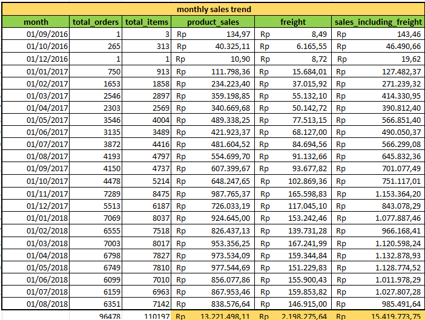
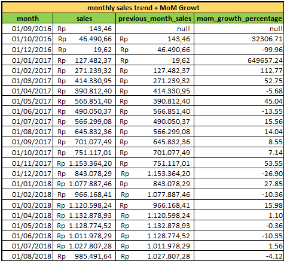

# EDA RESULT / INSIGHT

## EDA 1 OVERALL BUSINESS PERFORMANCE KPI
### tujuan 
Mengukur kondisi bisnis secara keseluruhan melalui baseline KPI dan memahami distribusi status order untuk mengetahui kondisi transaksi Olist.
### Proses Analisis
1. Menghitung total orders, total customers, active sellers.
2. menghitung AOV
3. Menghitung total product sales / transaction value.
4. Menghitung distribusi order berdasarkan `order_status`.
5. Mengidentifikasi status order yang paling dominan.
6. Membandingkan nilai transaksi berdasarkan status order.
### finding
- Olist memiliki sekitar 99441 orders, 96096 customers, 3095 active sellers
- Average order value adalah 160.58 
- Mayoritas order berada pada status delivered.
- Status non-delivered seperti canceled, shipped, processing, dan lainnya memiliki proporsi jauh lebih kecil.
- Hal ini menunjukkan bahwa sebagian besar order berhasil mencapai tahap penyelesaian.
### Output
- Baseline KPI
- Order status distribution
- Sales / transaction value by order status
### Kesimpulan
Olist memiliki volume transaksi yang besar, yakni 99441 order dan 96096 total customers dengan mayoritas order berhasil diselesaikan yakni 96478 order. Meskipun demikian, keberadaan canceled dan non-delivered orders menunjukkan adanya operational issues yang perlu dianalisis lebih lanjut pada tahap cancellation dan delivery performance.
  
## EDA 2 SALES PERFORMANCE 
### tujuan 
Menganalisis perkembangan penjualan dari waktu ke waktu dan mengidentifikasi pola pertumbuhan maupun penurunan sales.
### Proses Analisis
1. Mengelompokkan transaksi berdasarkan bulan.
2. Menghitung monthly sales dan order volume.
3. Menghitung Month-over-Month (MoM) growth.
4. Mengidentifikasi periode dengan pertumbuhan dan penurunan terbesar.
5. Menghitung Sales by State
6. Menghitung Sales by Payment Method
### finding
- Sales mengalami fluktuasi sepanjang periode observasi.
- Terdapat periode dengan pertumbuhan maupun penurunan monthly sales.
- MoM growth membantu mengidentifikasi perubahan performa jangka pendek.
- total sales terbanyak adalah dari SP (sao paulo) dengan 40501 total orders dan 5769703.15 total transaction value

| No    | customer_state | total_orders | total_transaction_value | avg_freight_cost |
|-------|----------------|--------------|-------------------------|------------------|
| 1     | SP             | 40501        | 5769703.15              | 15.12            |
| 2     | RJ             | 12350        | 2055401.57              | 20.91            |
| 3     | MG             | 11354        | 1818891.67              | 20.63            |
| +24     | ...            | ...          | ...                     | ...              |

  
- total sales terbanyakan menggunakan payment method credit

| payment_type | total_orders | total_transactions | total_revenue | revenue_contribution_pct |
|--------------|--------------|--------------------|---------------|--------------------------|
| credit_card  | 74304        | 74586              | 12101094.88   | 78.46                    |
| boleto       | 19191        | 19191              | 2769932.58    | 17.96                    |
| voucher      | 3679         | 5493               | 343013.19     | 2.22                     |
| debit_card   | 1485         | 1486               | 208421.12     | 1.35                     |
 
### Output
- Monthly Sales Trend
- Monthly Order Trend
- Monthly Sales + MoM Growth
- sales by state
- sales bu payment method
### Kesimpulan
Sales Olist menunjukkan pola yang dinamis sepanjang periode observasi. Analisis MoM memberikan gambaran mengenai perubahan performa penjualan dari bulan ke bulan dan dapat digunakan untuk mengidentifikasi periode pertumbuhan maupun penurunan.

reference : 
, 

## EDA 3 PRODUCT & CATEGORY PERFORMANCE
### tujuan 
Mengidentifikasi kategori dan produk yang menjadi kontributor utama terhadap sales.
### Proses Analisis
1. Menghubungkan orders, order_items, dan products.
2. Menghitung sales per product category.
3. Mengurutkan kategori berdasarkan sales dan volume.
4. Mengidentifikasi top-performing categories dan product.
### finding
- jumlah kategori untuk high sales lebih rendah dari pada medium sales dan low sales. namun tetap memberikan kontribusi sales paling tinggi

| sales_category | total_categories | min_product_sales | max_product_sales | total_segment_sales | keterangan              |
|----------------|------------------|-------------------|-------------------|---------------------|-------------------------|
| High Sales     | 14               | 323667.53         | 1258681.34        | 10094461.45         | (x >= 300.000)          |
| Medium Sales   | 27               | 39669.61          | 273960.70         | 3168840.77          | (300.000 > x >= 30.000) |
| Low Sales      | 31               | 283.29            | 29393.41          | 328341.48           | (x < 30.000)            |

- Beberapa kategori/produk menjadi revenue drivers utama.
- Terdapat perbedaan antara kategori/produk dengan sales tinggi dan kategori/produk dengan volume transaksi tinggi.

kategori
 

produk
 

### Output
- Sales by category
- Top product categories
- Top product 
- Product/category sales contribution
### Kesimpulan
Beberapa kategori memberikan kontribusi signifikan terhadap sales Olist. Kategori dengan kontribusi tinggi perlu diperhatikan sebagai revenue drivers, sementara kategori dengan volume tinggi tetapi nilai transaksi relatif rendah perlu dievaluasi dari sisi product mix dan average order value

## EDA 4 CUSTOMERS PERFORMANCE
### tujuan 
Memahami perilaku pembelian customer, tingkat repeat purchase, serta perbedaan nilai customer antara one-time dan repeat customers.
### Proses Analisis
1. Mengidentifikasi customer berdasarkan customer_unique_id.
2. Menghitung jumlah order per customer.
3. Mengelompokkan customer menjadi:
4.  * one-time
    * repeat
5. Menghitung repeat purchase rate.
6. Membandingkan average customer value.
7. Menganalisis pola repeat purchase.
8. menghitung distribusi customer berdasarkan wilayah
### finding

| total_customers | one_time_customers | repeat_customers | repeat_customer_rate | one_time_customer_rate |
|-----------------|--------------------|------------------|----------------------|------------------------|
| 96096           | 93099              | 2997             | 3.12                 | 96.88                  |

- Repeat customer rate hanya 3.12%.
- 96.88% customer merupakan one-time customers.
- Average customer value:
  * One-time: 160.28
  * Repeat: 307.66

| customer_type | total_customers | total_sales | sales_contribution_pct | average_customer_value |
|---------------|-----------------|-------------|------------------------|------------------------|
| One-time      | 93099           | 14921510.75 | 94.18                  | 160.28                 |
| Repeat        | 2997            | 922042.49   | 5.82                   | 307.66                 |

- Repeat customers memiliki nilai rata-rata sekitar dua kali customer one-time.
- 52.70% repeat customers melakukan pembelian lintas kategori.
- 47.30% melakukan pembelian dalam kategori yang sama.

| repeat_behavior | repeat_customers | percentage |
|-----------------|------------------|------------|
| Cross Category  | 1476             | 52.70      |
| Same Category   | 1325             | 47.30      |

- customer terbanyak berasal dari SP dengan total 39156 customers

| No    | customer_state | total_customers | total_orders | total_sales | customer_share_pct | revenue_share_pct |
|-------|----------------|-----------------|--------------|-------------|--------------------|-------------------|
| 1     | SP             | 39156           | 40501        | 5769703.15  | 41.92              | 37.42             |
| 2     | RJ             | 11917           | 12350        | 2055401.57  | 12.76              | 13.33             |
| 3     | MG             | 11001           | 11354        | 1818891.67  | 11.78              | 11.80             |
| +24 | ...            | ...             | ...          | ...         | ...                | ...               |

### Output
- One-time vs repeat customer distribution
- Repeat purchase rate
- Average customer value
- Same-category vs cross-category repeat behavior
### Kesimpulan
Customer retention merupakan salah satu peluang bisnis utama. Meskipun repeat customers hanya mencakup sebagian kecil customer, mereka memiliki average customer value yang jauh lebih tinggi dibandingkan one-time customers. Hal ini menunjukkan potensi ekonomi dari strategi peningkatan repeat purchase.

## EDA 5 SELLERS PERFORMANCE
### tujuan 
Menilai konsentrasi sales pada seller dan mengidentifikasi seller yang menunjukkan indikasi operational issues.
### Proses Analisis
1. Menghitung sales per seller.
2. Mengurutkan seller berdasarkan sales value dan volume.
3. Menghitung kontribusi top sellers.
4. mengidentifikasi detail informasil sellers.
5. Menghitung seller cancellation rate.
6. Membandingkan cancellation rate dengan order volume.
### finding
- terdapat perbedaan antara sellers dengan total sales value tertinggi dengan volume sales tertinggi.

* high volume sales

| No    | seller_id                        | total_orders | total_items | product_sales | average_order_sales |
|-------|----------------------------------|--------------|-------------|---------------|---------------------|
| 1     | 6560211a19b47992c3666cc44a7e94c0 | 1854         | 2033        | 123304.83     | 66.51               |
| 2     | 4a3ca9315b744ce9f8e9374361493884 | 1806         | 1987        | 200472.92     | 111.00              |
| 3     | 1f50f920176fa81dab994f9023523100 | 1404         | 1931        | 106939.21     | 76.17               |
| +3092 | ...                              | ...          | ...         | ...           | ...                 |

* high value sales 

| No    | seller_id                        | total_orders | total_items | product_sales | average_order_sales |
|-------|----------------------------------|--------------|-------------|---------------|---------------------|
| 1     | 4869f7a5dfa277a7dca6462dcf3b52b2 | 1132         | 1156        | 229472.63     | 202.71              |
| 2     | 53243585a1d6dc2643021fd1853d8905 | 358          | 410         | 222776.05     | 622.28              |
| 3     | 4a3ca9315b744ce9f8e9374361493884 | 1806         | 1987        | 200472.92     | 111.00              |
| +3092 | ...                              | ...          | ...         | ...           | ...                 |

- seller dengan sales value tertinggi berada pada wilayah/state `SP`(sao paulo) guariba

| No    | seller_id                        | seller_city      | seller_state | product_sales |
|-------|----------------------------------|------------------|--------------|---------------|
| 1     | 4869f7a5dfa277a7dca6462dcf3b52b2 | guariba          | SP           | 229472.63     |
| 2     | 53243585a1d6dc2643021fd1853d8905 | lauro de freitas | BA           | 222776.05     |
| 3     | 4a3ca9315b744ce9f8e9374361493884 | ibitinga         | SP           | 200472.92     |
| +3092 | ...                              | ...              | ...          | ...           |

- daerah dengan jumlah sellers terbanyak dan sales value tertinggi yaitu berada di SP (sao paulo) dengan persentasi 59.56 % dari jumlah total sellers dan 64.57% dari jumlah total sales

| No  | seller_state | total_sellers | total_orders | total_sales | sellers_share_pct | sales_share_pct |
|-----|--------------|---------------|--------------|-------------|-------------------|-------------------|
| 1   | SP           | 1769          | 68641        | 9957056.91  | 59.56             | 64.57             |
| 2   | PR           | 335           | 7512         | 1424161.25  | 11.28             | 9.24              |
| 3   | MG           | 236           | 7735         | 1184427.54  | 7.95              | 7.68              |
| +19 | ...          | ...           | ...          | ...         | ...               | ...               |

- Revenue relatif tidak terlalu terkonsentrasi pada sedikit seller.
- Beberapa seller memiliki cancellation rate relatif tinggi.
- Cancellation rate perlu dibaca bersama order volume. 
### Output
- Seller sales ranking
- Top seller contribution
- Seller cancellation rate
- Seller operational performance
### Kesimpulan
Olist tidak menunjukkan ketergantungan yang tinggi terhadap sejumlah kecil seller. Risiko utama berada pada operational performance seller tertentu, terutama seller dengan kombinasi order volume yang signifikan dan cancellation rate yang tinggi.

## EDA 6 DELIVERY PERFORMANCE
### tujuan 

### Proses Analisis
1. Menghitung delivery duration.
2. Membandingkan actual delivery dengan estimated delivery.
3. Mengklasifikasikan order menjadi:
   * early/On Time
   * Late
4. Menghitung late delivery rate.
5. menghitung sellers processing time
7. mengidentifikasi dampak ke review score
8. menghitung delivery performance untuk masing-masing state.
### finding
- on time / early delivery memiliki persentasi yang jauh lebih tinggi dibandingkan late_delivery
  
| delivery_status | total_orders | percentage |
|-----------------|--------------|------------|
| Late            | 6534         | 6.77       |
| On-Time / Early | 89913        | 93.23      |

- Proses Penyiapan Pesanan (Seller Processing Time): Penjual membutuhkan waktu rata-rata 2,85 hari (~68,5 jam) untuk memproses pesanan dan menyerahkan barang ke pihak kurir sejak pembayaran dikonfirmasi.
  
| avg_seller_processing_days | avg_seller_processing_hours |
|----------------------------|-----------------------------|
| 2.85                       | 68.49                       |

- Terdapat korelasi kuat antara keterlambatan pengiriman dan penurunan skor ulasan. Pesanan yang sampai tepat waktu atau lebih awal (On-Time / Early) mencatatkan rata-rata review score sebesar 4,29/5.00, sedangkan pesanan yang terlambat (Late) mengalami penurunan drastis menjadi 2,27/5.00 (turun sebesar 47,08%).

| delivery_performance | total_orders | avg_review_score | count_5_star | count_1_star |
|----------------------|--------------|------------------|--------------|--------------|
| Late                 | 6381         | 2.27             | 1060         | 3444         |
| On-Time / Early      | 89420        | 4.29             | 55994        | 5953         |

- São Paulo (SP) mendominasi volume transaksi (46.441 pesanan) sekaligus menjadi wilayah paling efisien dengan durasi pengiriman 8,3 hari dan ongkir rata-rata R$ 15,11.
- Negara bagian seperti MG, PR, DF, RS, dan SC menjaga konsistensi performa dengan On-Time Rate di atas 90–95% dan durasi pengiriman di bawah 15 hari.

### Output
- Delivery Performance: 93.23% pesanan berhasil tiba tepat waktu atau lebih awal, sedangkan 6.77% mengalami keterlambatan.
- Seller Processing: Rata-rata seller membutuhkan 2,85 hari (68,49 jam) sejak pembayaran dikonfirmasi hingga menyerahkan pesanan kepada kurir.
- Customer Experience: Pesanan terlambat memiliki rata-rata review 2,27/5, dibandingkan 4,29/5 untuk pesanan On-Time/Early. Ini menunjukkan perbedaan yang sangat besar pada customer satisfaction.
- Geographic Performance: São Paulo (SP) mendominasi volume dengan 46.441 orders, sekaligus menunjukkan performa delivery yang efisien dengan rata-rata durasi 8,3 hari dan freight rata-rata R$15,11. MG, PR, DF, RS, dan SC juga menunjukkan performa relatif baik dengan On-Time Rate >90–95%
### Kesimpulan
Secara keseluruhan, performa delivery Olist tergolong baik, dengan 93,23% pesanan tiba tepat waktu atau lebih awal. Namun, keterlambatan tetap menjadi isu penting karena berkaitan kuat dengan penurunan customer satisfaction, ditunjukkan oleh rata-rata review 2,27 dibandingkan 4,29 pada pesanan On-Time/Early. Rata-rata seller processing time sebesar 2,85 hari menunjukkan bahwa proses fulfillment di sisi seller merupakan salah satu tahap yang perlu dipantau. Secara geografis, São Paulo menjadi kontributor volume terbesar sekaligus menunjukkan performa delivery yang efisien.
